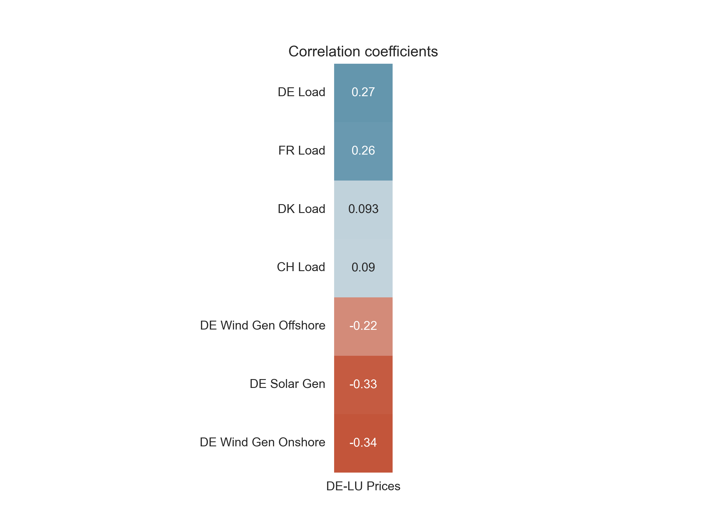

# Electricity Price Forecasting on the German day-ahead market

This repository contains the code for my bachelors thesis "Forecasting electricity prices in the German day-ahead market with machine learning algorithms". The project-structure largely follows the how-to from cookiecutter data science [[1]](./references/refs.md). For a clean interaction with the tool, a cli app has been integrated using Typer. The code and idea for the cli app are strongly inspired by [[5]](./references/refs.md) and [[6]](./references/refs.md).

---

**Table of Contents**

- [Initial Feature Selection](#initial-feature-selection)
- [Data Preprocessing](#data-preprocessing)
  - [Feature Analysis](#feature-analysis)
  - [Feature Engineering](#feature-engineering)

---

### Initial Feature Selection

*All timeseries were exported in UTC time format for consistency.*

|          Feature           | Market / Bidding Zone |    Interval    | Format |        Start (UTC)         |         End (UTC)          |                                                                                                                                                                      Source                                                                                                                                                                      |
|:--------------------------:|:---------------------:|:--------------:|:------:|:--------------------------:|:--------------------------:|:------------------------------------------------------------------------------------------------------------------------------------------------------------------------------------------------------------------------------------------------------------------------------------------------------------------------------------------------:|
|           Prices           |         DE_LU         |     hourly     |  csv   | 2022-12-31<br>T23:00+00:00 | 2024-12-31<br>T22:45+00:00 |                  [DE_LU Prices 2023](https://www.energy-charts.info/charts/price_spot_market/chart.htm?l=de&c=DE&year=2023&interval=year&legendItems=fy6&timezone=utc)<br>[DE_LU Prices 2024](https://www.energy-charts.info/charts/price_spot_market/chart.htm?l=de&c=DE&year=2024&interval=year&legendItems=ey5&timezone=utc)                  |
|            Load            |          DE           | quarter-hourly |  csv   | 2022-12-31<br>T23:00+00:00 | 2024-12-31<br>T22:45+00:00 |                     [DE Load 2023](https://www.energy-charts.info/charts/power/chart.htm?l=de&c=DE&legendItems=nyi&year=2023&interval=year&timezone=utc&source=entsoe)<br>[DE Load 2024](https://www.energy-charts.info/charts/power/chart.htm?l=de&c=DE&legendItems=nyi&year=2024&interval=year&timezone=utc&source=entsoe)                     |
|      Solar Generation      |          DE           | quarter-hourly |  csv   | 2022-12-31<br>T23:00+00:00 | 2024-12-31<br>T22:45+00:00 |         [DE Solar Generation 2023](https://www.energy-charts.info/charts/power/chart.htm?l=de&c=DE&legendItems=nyh&year=2023&interval=year&timezone=utc&source=entsoe)<br>[DE Solar Generation 2024](https://www.energy-charts.info/charts/power/chart.htm?l=de&c=DE&legendItems=nyh&year=2024&interval=year&timezone=utc&source=entsoe)         |
| Wind Generation (Onshore)  |          DE           | quarter-hourly |  csv   | 2022-12-31<br>T23:00+00:00 | 2024-12-31<br>T22:45+00:00 |  [DE Wind Generation Onshore 2023](https://www.energy-charts.info/charts/power/chart.htm?l=de&c=DE&legendItems=nyg&year=2023&interval=year&timezone=utc&source=entsoe)<br>[DE Wind Generation Onshore 2024](https://www.energy-charts.info/charts/power/chart.htm?l=de&c=DE&legendItems=nyg&year=2024&interval=year&timezone=utc&source=entsoe)  |
| Wind Generation (Offshore) |          DE           | quarter-hourly |  csv   | 2022-12-31<br>T23:00+00:00 | 2024-12-31<br>T22:45+00:00 | [DE Wind Generation Offshore 2023](https://www.energy-charts.info/charts/power/chart.htm?l=de&c=DE&legendItems=nyf&year=2023&interval=year&timezone=utc&source=entsoe)<br>[DE Wind Generation Offshore 2024](https://www.energy-charts.info/charts/power/chart.htm?l=de&c=DE&legendItems=nyf&year=2024&interval=year&timezone=utc&source=entsoe) |
|       Gas Generation       |          DE           | quarter-hourly |  csv   | 2022-12-31<br>T23:00+00:00 | 2024-12-31<br>T22:45+00:00 |           [DE Gas Generation 2023](https://www.energy-charts.info/charts/power/chart.htm?l=de&c=DE&source=entsoe&legendItems=ny8&year=2023&interval=year&timezone=utc)<br>[DE Gas Generation 2024](https://www.energy-charts.info/charts/power/chart.htm?l=de&c=DE&source=entsoe&legendItems=ny8&year=2024&interval=year&timezone=utc)           |
|    Hard Coal Generation    |          DE           | quarter-hourly |  csv   | 2022-12-31<br>T23:00+00:00 | 2024-12-31<br>T22:45+00:00 |     [DE Hard Coal Generation 2023](https://www.energy-charts.info/charts/power/chart.htm?l=de&c=DE&source=entsoe&legendItems=ny6&year=2023&interval=year&timezone=utc)<br>[DE Hard Coal Generation 2024](https://www.energy-charts.info/charts/power/chart.htm?l=de&c=DE&source=entsoe&legendItems=ny5&year=2024&interval=year&timezone=utc)     |
|     Lignite Generation     |          DE           | quarter-hourly |  csv   | 2022-12-31<br>T23:00+00:00 | 2024-12-31<br>T22:45+00:00 |       [DE Lignite Generation 2023](https://www.energy-charts.info/charts/power/chart.htm?l=de&c=DE&source=entsoe&legendItems=ny5&year=2023&interval=year&timezone=utc)<br>[DE Lignite Generation 2024](https://www.energy-charts.info/charts/power/chart.htm?l=de&c=DE&source=entsoe&legendItems=ny4&year=2024&interval=year&timezone=utc)       |
|            Load            |          CH           |     hourly     |  csv   | 2022-12-31<br>T23:00+00:00 | 2024-12-31<br>T22:45+00:00 |                     [CH Load 2023](https://www.energy-charts.info/charts/power/chart.htm?l=de&c=CH&legendItems=cy7&year=2023&interval=year&source=entsoe&timezone=utc)<br>[CH Load 2024](https://www.energy-charts.info/charts/power/chart.htm?l=de&c=CH&legendItems=cy7&year=2024&interval=year&source=entsoe&timezone=utc)                     |
|            Load            |          DK           |     hourly     |  csv   | 2022-12-31<br>T23:00+00:00 | 2024-12-31<br>T22:45+00:00 |                     [DK Load 2023](https://www.energy-charts.info/charts/power/chart.htm?l=de&c=DK&legendItems=fy9&year=2023&interval=year&source=entsoe&timezone=utc)<br>[DK Load 2024](https://www.energy-charts.info/charts/power/chart.htm?l=de&c=DK&legendItems=fy9&year=2024&interval=year&source=entsoe&timezone=utc)                     |
|            Load            |          FR           |     hourly     |  csv   | 2022-12-31<br>T23:00+00:00 | 2024-12-31<br>T22:45+00:00 |                     [FR Load 2023](https://www.energy-charts.info/charts/power/chart.htm?l=de&c=FR&legendItems=jye&year=2023&interval=year&source=entsoe&timezone=utc)<br>[FR Load 2024](https://www.energy-charts.info/charts/power/chart.htm?l=de&c=FR&legendItems=jye&year=2024&interval=year&source=entsoe&timezone=utc)                     |
|           Prices           |          CH           |     hourly     |  csv   | 2022-12-31<br>T23:00+00:00 | 2024-12-31<br>T22:45+00:00 |                     [CH Prices 2023](https://www.energy-charts.info/charts/price_spot_market/chart.htm?l=de&c=CH&legendItems=by4&year=2023&interval=year&timezone=utc)<br>[CH Prices 2024](https://www.energy-charts.info/charts/price_spot_market/chart.htm?l=de&c=CH&legendItems=by4&year=2024&interval=year&timezone=utc)                     |
|           Prices           |          DK1          |     hourly     |  csv   | 2022-12-31<br>T23:00+00:00 | 2024-12-31<br>T22:45+00:00 |                    [DK1 Prices 2023](https://www.energy-charts.info/charts/price_spot_market/chart.htm?l=de&c=DK&legendItems=7y4&year=2023&interval=year&timezone=utc)<br>[DK1 Prices 2024](https://www.energy-charts.info/charts/price_spot_market/chart.htm?l=de&c=DK&legendItems=7y4&year=2024&interval=year&timezone=utc)                    |
|           Prices           |          DK2          |     hourly     |  csv   | 2022-12-31<br>T23:00+00:00 | 2024-12-31<br>T22:45+00:00 |                    [DK2 Prices 2023](https://www.energy-charts.info/charts/price_spot_market/chart.htm?l=de&c=DK&legendItems=7y5&year=2023&interval=year&timezone=utc)<br>[DK2 Prices 2024](https://www.energy-charts.info/charts/price_spot_market/chart.htm?l=de&c=DK&legendItems=7y5&year=2024&interval=year&timezone=utc)                    |
|           Prices           |          FR           |     hourly     |  csv   | 2022-12-31<br>T23:00+00:00 | 2024-12-31<br>T22:45+00:00 |                    [FR Prices 2023](https://www.energy-charts.info/charts/price_spot_market/chart.htm?l=de&c=FR&legendItems=8y6&year=2023&interval=year&timezone=utc)<br>[FR Prices 2024 ](https://www.energy-charts.info/charts/price_spot_market/chart.htm?l=de&c=FR&legendItems=8y6&year=2024&interval=year&timezone=utc)                     |

### Data Preprocessing

Explanatory data analysis is done in ```epf/notebooks/exploratory_analysis.ipynb```.

#### Feature Analysis

For feature analysis all timeseries were read into pandas DataFrames. Timeseries with a quarter hourly frequency were 
aggregated to the hour level using mean gruping. All Dataframes were then merged into a single DataFrame. 
Initial feature exploration shows that the features are seasonal and non stationary timeseries:


The pearson correlation coefficients for the feature "Prices" show a similar positive correlation between de_lu_prices 
and the German load as well as the French load. Likewise all VRE generation features show a negative correlation with
the prices, with the offshore wind generation having a slightly weaker correlation than onshore wind generation and
solar generation.




### Feature engineering

Some timeseries (most notably de_lu_prices, ch_load and dk_load) have extreme outliers. 
Outlier filtering is done using a hampel filter [[3]](./references/refs.md) with window size = 72 hours 
and a threshold of 3 standard deviations.
Note that we cant use log transformation since there could be zero and negative values for which the log is not defined.
All timeseries are also deseasonalized using stl decomposition as RNNs perform weaker when trying to learn seasonal
patterns [[7]](./references/refs.md).
After normalization the resulting distributions of the features are shown in the following plot:

